# Talk: Grokking — How AI Learns to Learn

## Core Idea

> A model can look like it's memorizing…
> until suddenly it understands.

---

## One Paragraph Summary

A tiny neural network is trained on simple modular math. At first, it memorizes and fails to generalize. Then suddenly—without warning—it becomes perfect. When researchers inspect it, they discover it didn't learn addition at all—it learned a *geometric representation* of numbers on a circle and uses rotations (implicitly trig) to solve the problem. This phenomenon, called **grokking**, shows that models can silently shift from memorization to real understanding—and we don't always know when or how that happens.

---

## Structure (the story)

### 1. Cold Open + Intro

* "When was the last time you learned a trig identity?"
* "Yeah… same."
* "Yeah well neither did this clanker."
* "Hello everyone, it's great to see your beautiful faces, my name is Patrick and tonight we're going to talk about how AI learns."

---

### 2. Demystifying the Model — What AI Actually Does

* "We're going to look at how it works, how it 'learns', and what we can learn from that."

**What a model sees:**
* Show the 1+2=3 one-hot encoding visual
  - The model doesn't see "1" and "2" — it sees patterns of switches flipped on and off
  - Input: three vectors with dots lit up. Output: a vector with a dot lit up.
  - We call it "1 + 2 = 3" — the model just sees patterns mapped to patterns

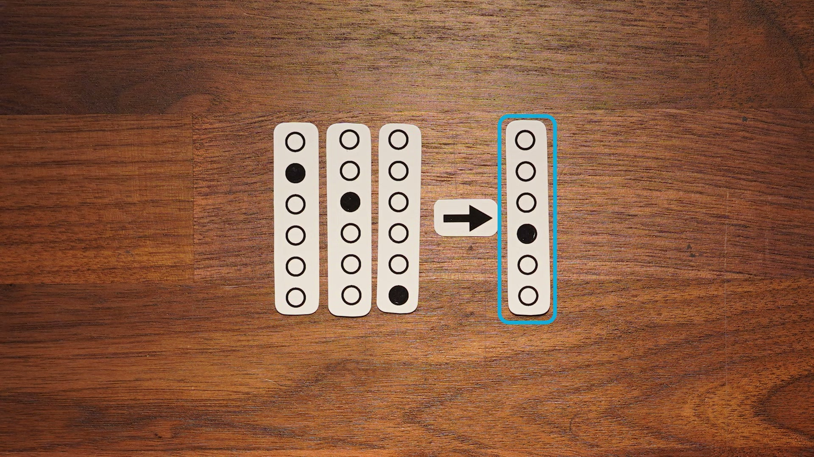

**What "learning" actually is:**
* Show the perceptron board — switches (inputs), dials (weights), meter (output)
* This is literally what a single artificial neuron looks like as a physical machine
* "Weights" are just dials — numbers that control how much each input matters
* "Learning" = turning the dials until the meter gives the right answer
  - Try an answer, see how wrong you were, nudge the dials in the direction of "less wrong"
  - Like adjusting a shower — too hot? turn down the hot knob proportionally to how far off you are
  - Repeat a billion times
* A modern model like ChatGPT is just ~100 million of these wired together, with the dials turned automatically

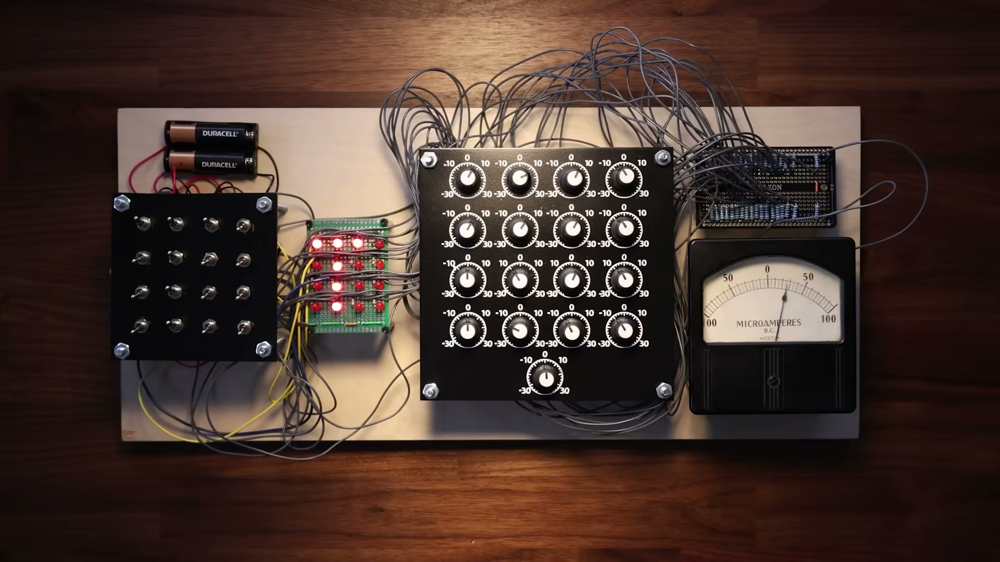

**The key insight:**
* There's no understanding happening — it's optimization
* We look at the outputs and project meaning onto them

> "It's easy to forget that the symbols we assign to our model's inputs and outputs have this extra meaning that we attach to them. But to the model, they're just patterns of inputs and outputs."

> "So with that in mind… let me show you something weird."

---

### 3. The Experiment

* Explain modular arithmetic with a clock:
  - "What's 10 + 5 on a 12-hour clock? 3."
  - When the number hits the max, it wraps around — that's modular math
  - You already do this every time you read a clock
* So researchers trained a tiny model on this — all the combinations of A + B mod 113
* Held back some examples for testing

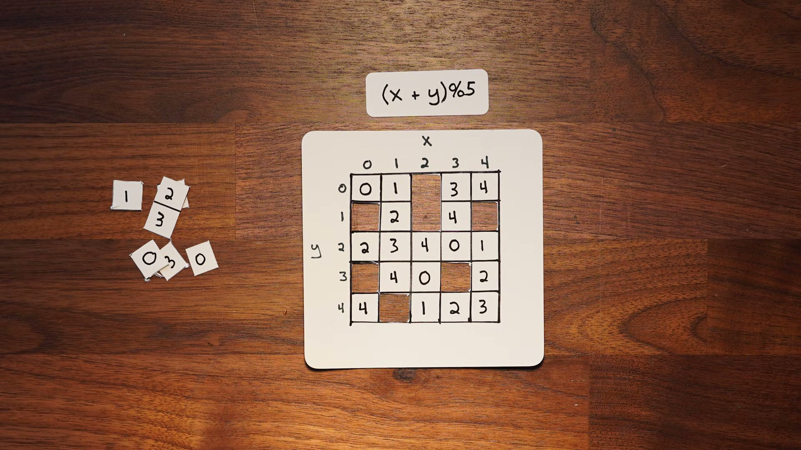

* Train accuracy → high (memorized the answers)
* Test accuracy → bad (can't do new problems)

> "Looks like overfitting. You'd stop here."

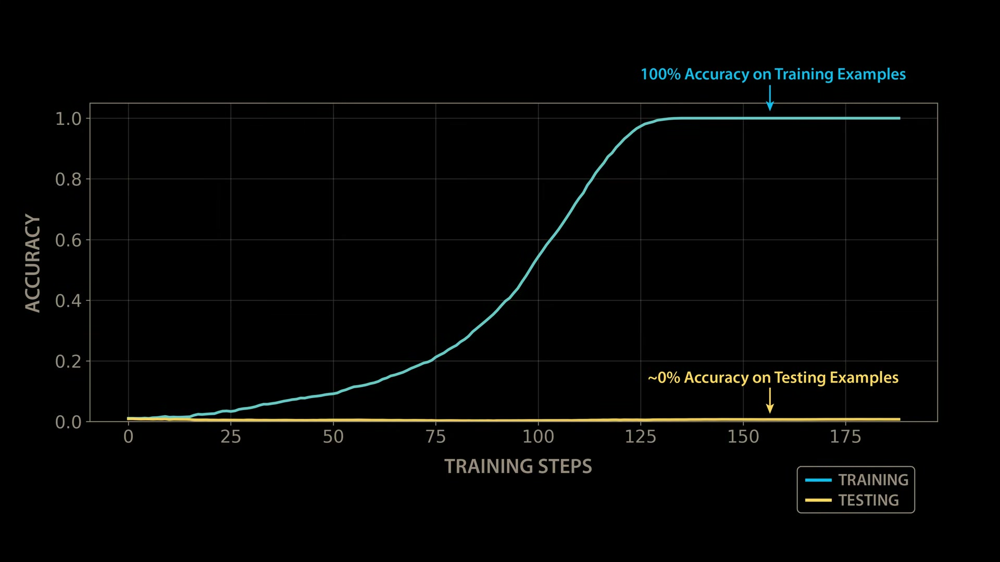

---

### 4. The Plateau

* Nothing improves for a long time

> "You'd probably stop training here."

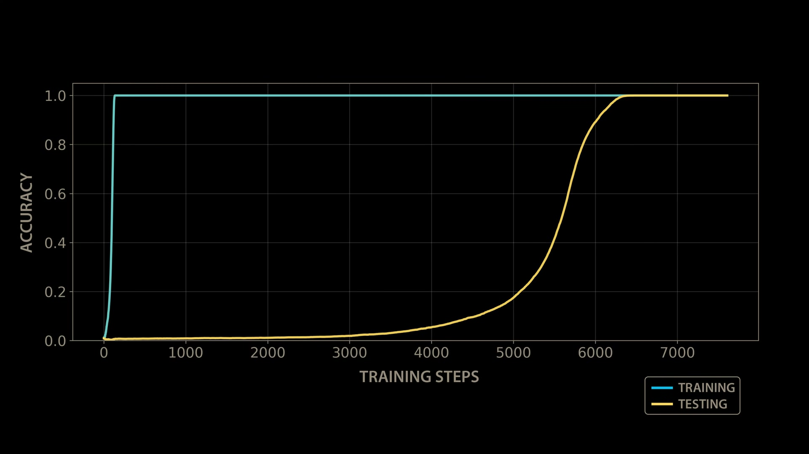

---

### 5. The "Oh Shit" Moment

* Sudden jump to perfect generalization

> "Not gradual. It just… snaps."

> "It stopped memorizing and started solving."

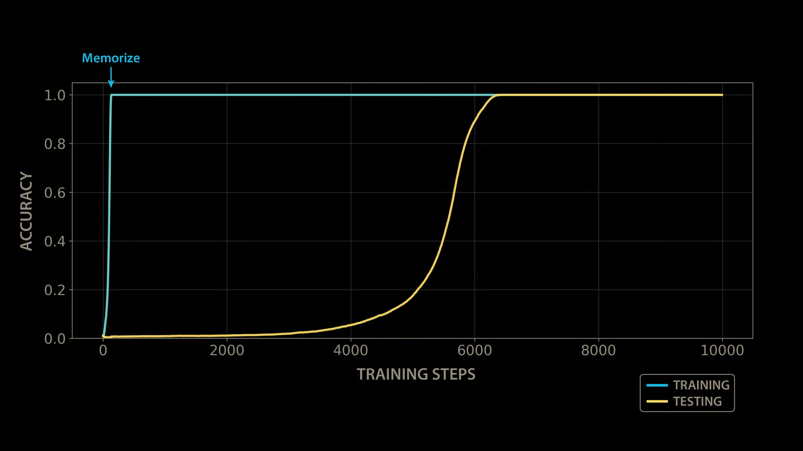

---

### 6. Reverse Engineering

* Look inside the model
* Expect: messy lookup behavior
* Reality: structured representation — waves, loops, circles
* Show the gif: watch the model go from noise to clean structure as it trains

> "So we popped the hood."

> "Watch what happens to the internals as it learns."

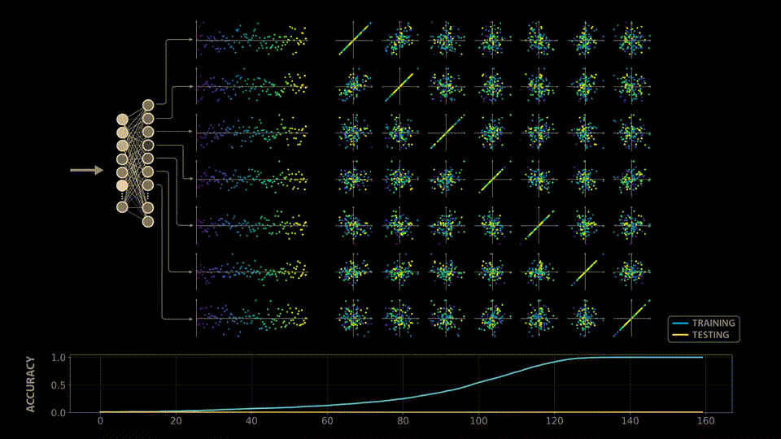
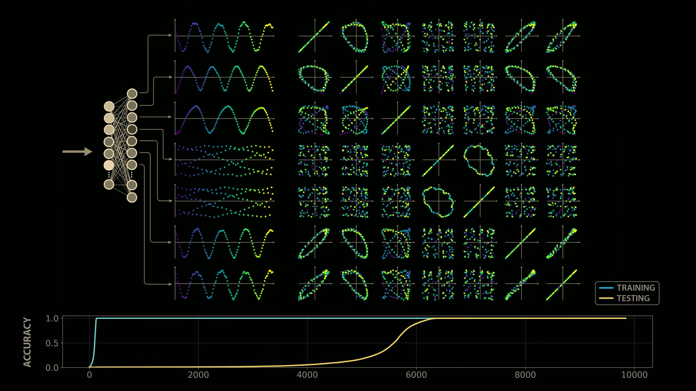
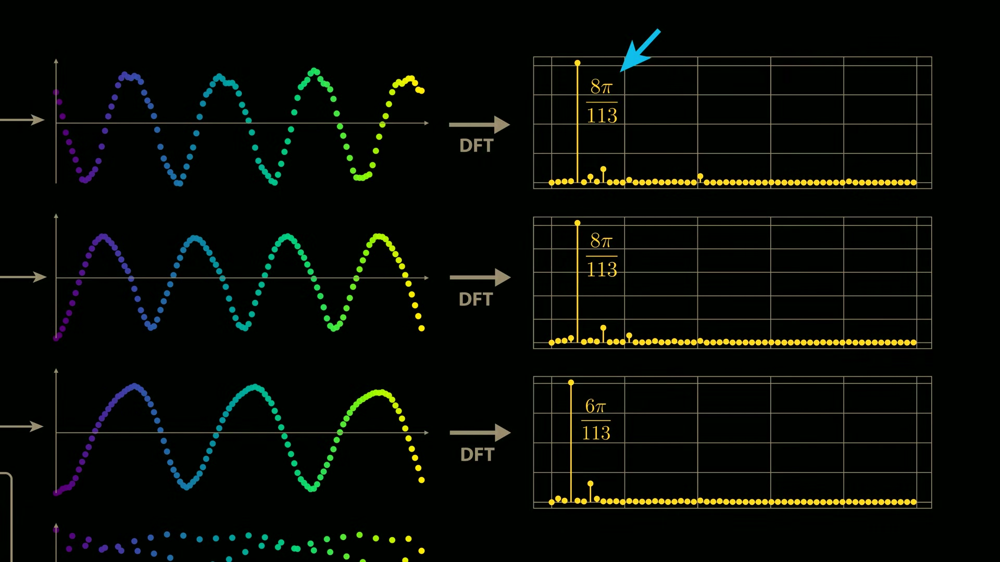

---

### 7. Visual Intuition

* The model learned to represent numbers as positions on a circle
* Modular math wraps around — just like a clock
* Addition = rotation around the circle
* The model independently discovered this

> "The model stops thinking in numbers… and starts thinking in positions."

---

### 8. The Reveal

* Early in the model: it computes cos and sin of its inputs
* Middle of the model: it computes products — cos(kx)cos(ky), sin(kx)sin(ky)
* Then it combines them: cos(kx)cos(ky) - sin(kx)sin(ky) = cos(k(x+y))
* That's a trig identity. It converts products of trig functions into a sum of the inputs.
* Best way to represent a circle → sine/cosine

> "So yeah… it reinvented trig."

> "It didn't learn addition. It learned a *geometry*."

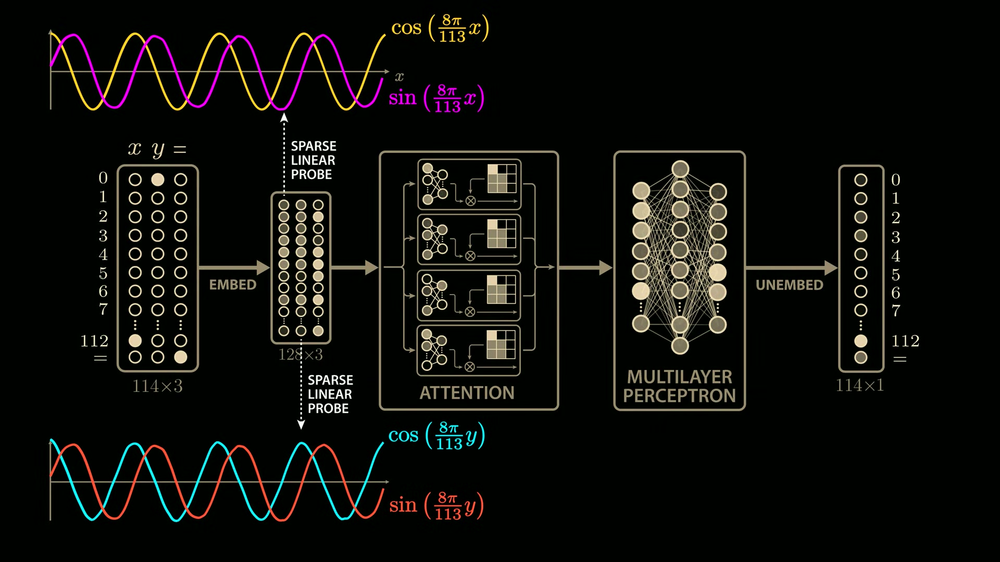
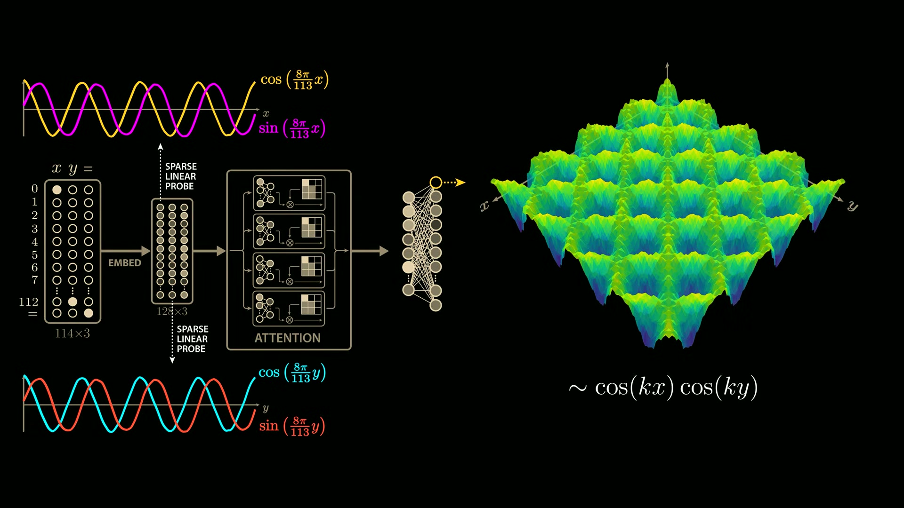
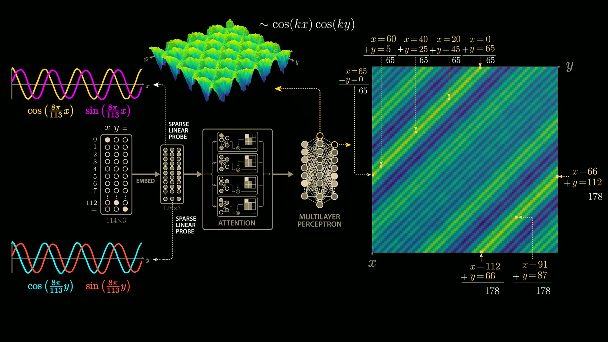

---

### 9. Why This Is Wild

* Not programmed
* Not in data
* Appears late
* Hidden during training
* You can watch it evolve — from noise to structure

> "It looked dumb… until it didn't."

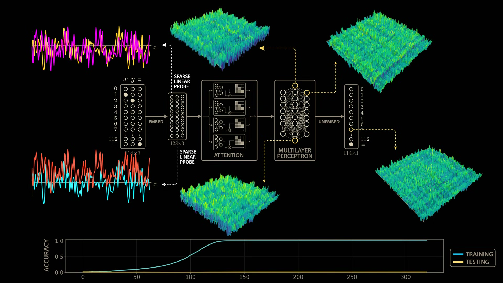
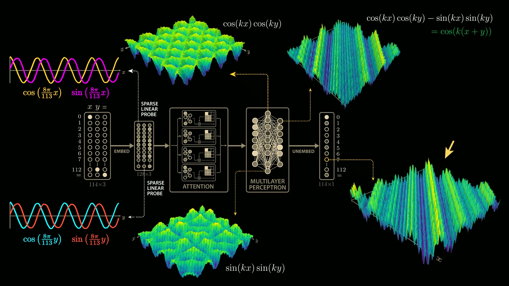

---

### 10. Takeaway

* Learning isn't linear
* Understanding can emerge suddenly
* Models build internal structure

> "If a tiny model can rediscover trig…
> what are bigger models doing?"

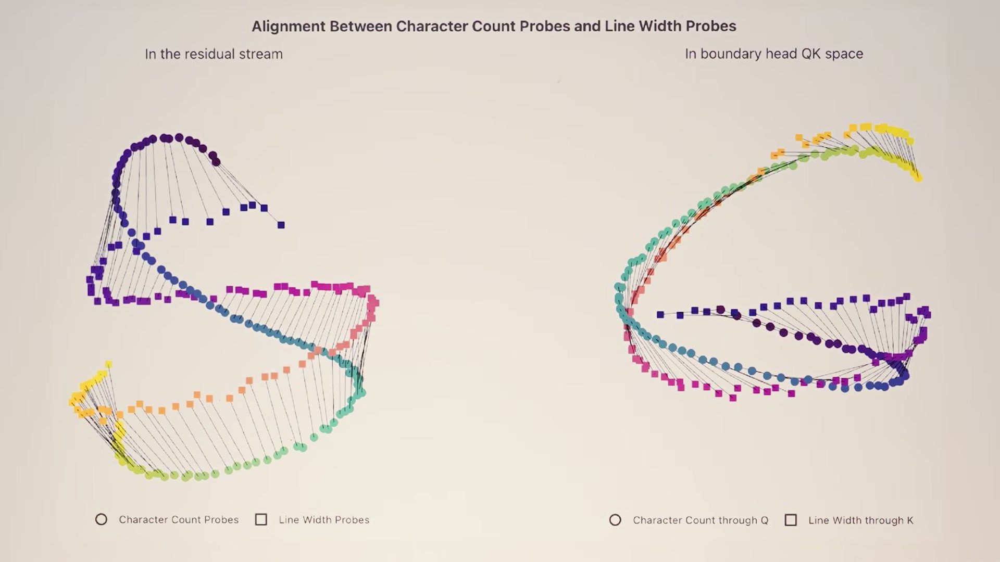

---

## 20-Min Slide Deck (minimal style)

| Slide | Content |
|-------|---------|
| 1 | Hook — "When was the last time you learned a trig identity?" |
| 2 | Vibe — "Whose slides are these anyway?" |
| 3 | The Lie — AI doesn't understand, just statistics |
| 4 | Setup — Train on modular addition |
| 5 | Curve — Train ↑, Test → flat |
| 6 | Plateau — "…nothing happens" |
| 7 | Jump — "sudden → perfect" |
| 8 | Oh Shit — "it changed strategies" |
| 9 | Pop the Hood — "what is it doing?" |
| 10 | Expectation — "lookup table" |
| 11 | Reality — "circular structure" |
| 12 | Clock — "modular math = clock" |
| 13 | Shift — "numbers → positions" |
| 14 | Movement — "addition = rotation" |
| 15 | Reveal — "sine / cosine" |
| 16 | Reframe — "it learned geometry" |
| 17 | Wild — not programmed, not in data |
| 18 | Insight — "understanding emerges" |
| 19 | Uneasy Thought — "what else is hiding?" |
| 20 | Close — "it looked dumb… until it didn't" |

---

## Key Visuals Needed

### 1. Training Curve
* X: training steps
* Y: accuracy
* Show: train → smooth rise, test → flat → sudden spike
* This sells grokking instantly

### 2. Circle Representation
* Numbers placed around a circle (clock style)

### 3. Rotation
* Arrow showing movement around circle

### 4. (Optional) Trig Hint
* Overlay sine/cosine idea subtly
* Don't over-explain

---

## Delivery Style

Lean into:
* curiosity
* "this is weird"
* reverse engineering vibe

Avoid:
* lecturing
* heavy math
* over-explaining trig

Use lines like:
* "this is where it gets weird"
* "this part broke my brain a bit"
* "this shouldn't work like this… but it does"

---

## Best Lines

* "It didn't get better. It changed strategies."
* "It stopped memorizing and started solving."
* "It learned a space where the problem becomes easy."
* "It looked dumb… until it didn't."
* "That's a useful lie… until it isn't."

---

## Open Decisions

### 1. How technical do you go inside the model?
* Recommended: stay intuitive
* Optional: show one real artifact for credibility

### 2. Do you add personal spin?
* Optional: mention LLMs
* "this should make you slightly uncomfortable"

### 3. Timing fallback
* Have a 15-min version ready
* Cut deeper explanation, keep story + reveal

---

## Source Material

* **Video**: Welch Labs — "The most complex model we actually understand" (35 min)
  * https://youtu.be/D8GOeCFFby4
* **OpenAI Grokking Paper**: https://arxiv.org/pdf/2201.02177
* **Nanda et al.**: https://arxiv.org/pdf/2301.05217v1
* **Quanta Magazine**: https://www.quantamagazine.org/how-do-machines-grok-data-20240412/
* **Neel Nanda's Mech Interp intro**: https://neelnanda.io/getting-started
* **Anthropic — Claude Haiku linebreaks**: https://transformer-circuits.pub/2025/linebreaks/index.html
